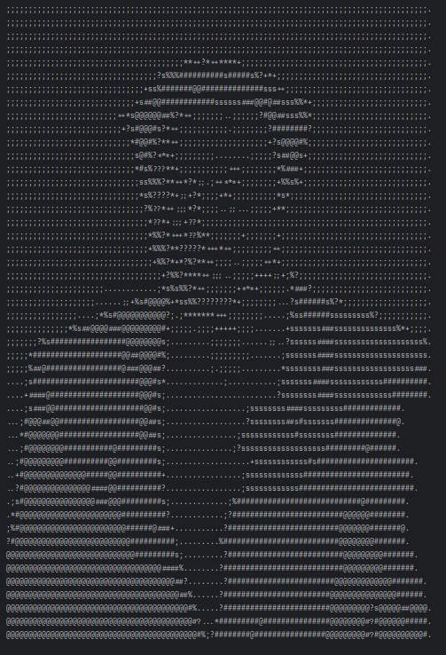

# 🖼️ Img2Ascii - Java Image to ASCII Art Converter

**Img2Ascii** is a simple Java program that converts an image into ASCII characters and prints the result in the terminal. It works by converting the image to grayscale and mapping brightness levels to ASCII symbols.

---

## 📁 Project Structure

```
img2ascii/
└── src/
    ├── img.png           # Example image (you can add more: img_1, img_2, etc.)
    ├── OUTPUT.png        # Output preview image (used in README)
    ├── Img2ascii.java    # Core logic for reading image and converting to ASCII
    └── Main.java         # Entry point of the program
```

---

## 🧰 Requirements

- Java Development Kit (JDK) 8 or above
- Any Java IDE (IntelliJ, Eclipse, VSCode) or command-line terminal

---

## 🔧 Setup & Run

### 🖥️ Using an IDE:
1. Open the project in your Java IDE.
2. Update the image path in `Main.java`:
   ```java
   demo.imageReader("C:/img2ascii/src/img.png");
   ```
   Or for Linux:
   ```java
   demo.imageReader("/home/abdullah/IdeaProjects/img2ascii/src/img.png");
   ```
3. Run `Main.java`.

### 🧑‍💻 Using Terminal:
Navigate to the project directory and run:

```bash
javac src/*.java
java -cp src Main
```

> ✅ Ensure your image file exists and the path is correct!

---

## ⚙️ How It Works

- Loads the image using Java's `ImageIO`
- For every 3rd row (to match character height), reads the pixels
- Converts each pixel's RGB to grayscale
- Maps grayscale brightness to an ASCII character using a brightness scale
- Prints it to the terminal

---

## 🎨 Brightness Mapping

From darkest to lightest:

```
@ # s % ? * + ; .
```

---

## ✏️ Sample Output

```
@@@###%%??**++;;..
@@@###%%??**++;;..
...,,,,,,,,,,,,,,,
```

---

## 🖼️ Example Output

Here’s how an image looks when converted into ASCII:



> The image above was processed using this program and shows terminal-style ASCII rendering.

---

## 📥 Clone This Repository

You can clone this project using Git:

```bash
git clone https://github.com/abdullahtahir-me/img2ascii.git
cd img2ascii
```

Then compile and run it:

```bash
javac src/*.java
java -cp src Main
```

> 📌 Make sure Java is installed and your image path in `Main.java` is correctly set.

---

## 🧠 Future Improvements

- Accept image file path as a command-line argument
- Resize image automatically
- Export ASCII output to a text file
- Add ANSI color output for terminals

---


## 👨‍💻 Author

**Muhammad Abdullah Khan**

---

## 💡 Tips

- Simple, high-contrast images give better ASCII results.
- You can tweak the ASCII character range in `printGray()` for different artistic styles.
